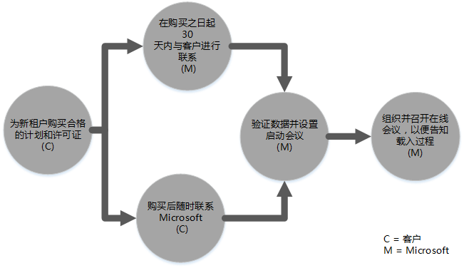
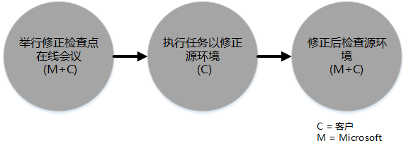
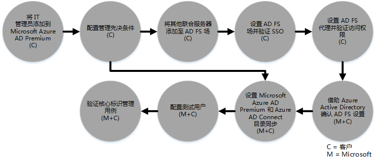

# Azure Active Directory Premium 的 FastTrack 中心权益流程 
如果你的组织具有 Microsoft Azure AD Premium 的 FastTrack 中心权益的资格，则可以与 Microsoft 专家远程合作，以准备 Microsoft Azure AD Premium 环境使其随时可用。 若要了解你的组织是否具有资格，请参阅 [Azure Active Directory Premium 的 FastTrack 中心权益](../Topic/FastTrack_Center_Benefit_for_Azure_Active_Directory_Premium.md)。

本文提供了以下信息：

-   [Overview of the onboarding process](#overview)

-   [Expectations for your source environment](#expectations_src_environ)

-   [Phases of the onboarding process](#phases_onboarding_process)

-   适用于每个阶段的 [Microsoft responsibilities](#microsoft_responsibilities)

-   适用于每个阶段的[Your responsibilities](#your_responsibilities)

载入完成后，您可以预期以下结果：

-   创建了 Microsoft Azure AD Premium 租户。

-   许可用户可使用以下标识选项之一来访问 Microsoft Azure AD Premium 服务：

    -   云标识（唯一的 Microsoft Azure AD Premium 帐户）。

    -   同步标识：针对具有单个林或多个 Active Directory 林的用户使用 Azure Active Directory Connect (Azure AD Connect) 工具从本地 Active Directory 同步的 Microsoft Azure AD Premium 帐户。

    -   联合身份--具有 Microsoft Azure AD Premium 帐户，该帐户：

        -   针对具有单一 Active Directory 林配置的用户，借助 Microsoft Azure AD Connect 工具从 Active Directory 同步。

        -   从本地 Active Directory 中与 Active Directory 联合身份验证服务 (AD FS) 2.0 或更高版本联合。

## 载入流程概述
载入包含两个主要部分：

-   **核心功能** - 租户配置和与 Azure AD 的集成所需的任务（如需要）。 核心功能还为载入其他符合条件的 Microsoft Online 服务提供基准。

-   **服务载入** - 独立配置或者借助 Azure AD Connect 目录同步或 AD FS 来配置 Microsoft Azure AD Premium 时所需的任务。

下图对使用 FastTrack 中心权益的日程表进行了说明。

基本流程如下所示：

-   Microsoft 将在你购买符合条件的计划后 30 天内与你联系。 如果你已准备好在你的组织中部署这些服务，你还可以通过 [FastTrack 中心](http://fasttrack.microsoft.com/)请求协助。 若要请求协助，请登录到 FastTrack 中心 (http://fasttrack.microsoft.com)，转到面板，选择公司名称，单击“产品/服务”选项卡，然后单击符合条件的服务的“请求协助”按钮。 启动载入支持之后，我们将为联机会议设置一个日程安排。

-   Microsoft 团队将针对核心功能为你提供帮助，然后就每个符合条件的服务帮助你进行一次载入。

所有载入支持均由 Microsoft 指定人员远程提供：

-   Microsoft 结合使用各种工具、文档和指南远程协助您完成各载入活动。 如果你希望 Microsoft 替你执行某些配置任务，则可以选择向 Microsoft 提供适当访问和权限，以便其执行上述任务。

-   FastTrack 中心针对指定区域在正常营业时间内提供载入支持。

-   提供繁体中文、英语、法语、德语、意大利语、日语、葡萄牙语（巴西）或西班牙语的载入支持。

-   Microsoft 团队可直接与你或你的代表进行合作。

## 源环境预期
可能你的源环境中已存在本地 Microsoft Active Directory，而你希望将其与 Microsoft Azure AD Premium 集成，以便从单个控制台使用丰富的标识管理。 FastTrack 中心权益包括帮助你将 Microsoft Azure AD Premium 与现有的本地实现进行集成。 如果需要集成，你的源环境必须处于此应用程序的最低级别。

下表介绍了用于载入的现有源环境的预期内容。

|活动|源环境预期|
|------|---------|
|核心功能|功能林级别设置为 Windows Server 2008 或更高版本且进行了以下林配置的 Active Directory 林：  -   单个 Active Directory 林 -   多个 Active Directory 林 **Note:** 对于所有多林配置，AD FS 部署不在 FastTrack 中心权益的范围之内。|
|服务载入  -   Microsoft Azure AD Premium|本地 Active Directory 及环境已准备就绪，可用于 Azure AD Premium，包括修正了会阻止 Azure AD 与 Azure AD Premium 功能集成的标识问题。|

## 载入流程阶段
Microsoft Azure AD Premium 载入有 5 个主要阶段，如下图中所示：

-   启动

-   评估

-   修正

-   启用

-   关闭

有关每个阶段的详细任务，请参阅 [Microsoft responsibilities](#microsoft_responsibilities)和[Your responsibilities](#your_responsibilities)部分。

### 启动阶段
购买适当数量的许可证后，请按照购买确认电子邮件中的指南将许可证与现有的租户或新租户相关联。 Microsoft 将验证你的 FastTrack 中心权益资格。 Microsoft 将在你购买符合条件的计划后 30 天内与你联系。 如果你已准备好在你的组织中部署这些服务，你还可以通过 [FastTrack 中心](http://fasttrack.microsoft.com/)请求协助。 若要请求协助，请登录到 FastTrack 中心 (http://fasttrack.microsoft.com)，转到面板，选择公司名称，单击“产品/服务”选项卡，然后单击符合条件的服务的“请求协助”按钮。 启动载入支持之后，我们将为联机会议设置一个日程安排。

在此阶段，我们将讨论载入流程，验证数据并设置启动会议。

### 评估阶段
载入流程开始之后，Microsoft 将与您一同评估您的源环境和要求。 将运行相关工具以评估你的环境，并且 Microsoft 将指导你评估本地 Active Directory、Internet 浏览器、客户端设备的操作系统、DNS、网络、基础结构和标识系统，以确定是否需要针对载入进行任何更改。 根据你的当前设置，我们将提供一个修正计划，将你的源环境调整至满足成功载入到 Microsoft Azure AD Premium 的最低要求。 在修正阶段，我们还会设置相应的检查点调用。

### 修正阶段
如果需要，您将针对源环境执行修正计划中的相关任务，以便满足载入每项服务的要求。

在开始启用阶段之前，我们将共同验证修正活动的结果以确保您可以继续后续操作。

### 启用阶段
完成所有修正活动后，项目会转而配置核心基础结构以使用服务，并设置 Microsoft Azure AD Premium。

**启用阶段 - 核心功能**

启用核心功能包括服务设置以及租户和标识集成。 还包括提供载入 Microsoft Azure AD Premium 的基础的步骤。

核心载入完成后，就可开始 Microsoft Azure AD Premium 的载入。

**启用阶段 – Microsoft Azure AD Premium**

根据需要，可以使用 Azure AD Connect 目录同步和 Active Directory 联合身份验证服务 (AD FS) 设置 Microsoft Azure AD Premium 环境。

对于包括将本地标识同步到云的 Microsoft Azure AD Premium 方案，我们将帮助你向你的订阅添加 IT 管理员和用户，配置管理先决条件、设置 Microsoft Azure AD Premium，使用 Azure AD Connect 设置目录同步和 Active Directory 联合身份验证服务，配置策略用户以及验证服务的核心用例。

Microsoft Azure AD Premium 设置包括启用以下功能：

-   自助服务密码重置 (SSPR)

-   Azure Multi-factor Authentication (MFA)

-   软件即服务 (SaaS) 应用程序 -- 设置一个 SaaS 应用程序

-   自助服务组管理 (SSGM)

-   管理报表

## Microsoft 职责

### 常规

-   对于所需的配置活动，为你提供远程支持协助（请参阅具体阶段中的详细说明）。

-   提供可用的文档和软件工具、管理控制台和脚本，帮助您减少或消除配置任务。

无需向 Microsoft 提供访问和权限，即可使用 FastTrack 中心权益。 在某些情况下，你可以选择向 Microsoft 提供适当访问和权限，以便其代表你执行特定活动。

### 启动阶段

-   对于新租户，在购买符合条件的许可证的 30 天内与您联系。

-   在购买符合条件的许可证的 90 天内协同您开始载入。

-   定义您要载入的符合条件的服务。

### 评估阶段

-   提供管理概述。

-   提供以下方面的指导：

    -   DNS、网络和基础结构需求。

    -   客户端需求（Internet 浏览器、客户端操作系统和服务需求）。

    -   用户标识和设置。

    -   目录同步标识要求。

    -   确定密码哈希同步是否符合客户目标，或 AD FS 是否必需。

    -   启用已购买且定义为载入部分的符合条件的服务。

    -   标识所需的试验和测试环境要求，例如，测试帐户、SaaS 应用程序的测试实例（如 SalesForce）。

-   为修正活动设置时间表。

-   提供修正清单。

### 修正阶段

-   根据商定的日程安排与你开始电话会议，以审核修正活动的进度。

-   运行工具以识别并解决问题，并对结果进行说明，从而提供协助。

### 启用阶段
提供以下方面的指导：

-   激活 Microsoft Azure AD Premium 帐户。

-   配置防火墙端口。

-   为符合条件的服务配置 DNS。

-   验证到 Microsoft Azure AD Premium 服务的连接。

-   对于单林环境：

    -   根据需要，在你的 Active Directory 域服务 (AD DS) 和 Azure AD Connect 之间安装目录同步。

    -   使用 Azure AD Connect 工具配置密码同步。

-   对于多林环境：

    -   安装 Azure AD Connect 同步，为多林方案进行设置。 请注意，密码哈希同步和密码写回支持多林。  但是，不支持其他写回方案。

    -   配置本地 Active Directory 林和 Microsoft Azure AD Premium 目录 (Azure Active Directory) 之间的同步。

        > [!NOTE]
        > 自定义规则扩展的开发和实现不在讨论范围内。

-   对于目标为联合标识的单林：根据需要安装并配置 Active Directory 联合身份验证服务 (AD FS)，以在单个站点、容错配置中使用 Microsoft Azure AD Premium 对本地域进行身份验证。

    > [!NOTE]
    > 对于多林配置，AD FS 部署不在讨论范围内。

-   如果已部署单一登录 (SSO)，请测试其功能。

#### 启用阶段 - Azure AD Premium-- 使用 Azure AD Connect 和 AD FS
提供设置以下内容的相关指导：

-   用户设置（包括许可）。

-   Azure AD Connect 目录同步（使用密码写回和密码哈希同步）。

-   Active Directory 联合身份验证服务 (AD FS)。

-   自助服务密码重置 (SSPR)。

-   多因素身份验证 (MFA)。

-   一个集成应用程序，包括针对 SaaS 应用程序的单一登录。

-   发至管理员的使用情况和阿娜全报告。

-   自助服务组管理 (SSGM)。

-   应用程序代理。

-   管理员通知。

-   自定义的登录屏幕（包括徽标、文本和图像）。

## 您的职责
本部分介绍您在载入流程期间的部分职责。

### 常规

-   Microsoft Azure AD Premium 租户的所有增强功能和集成（不在本文所列的可配置选项之内）。

-   资源的总体计划和项目管理。

-   最终用户通讯、文档、培训和变更管理。

-   支持人员文档和培训。

-   制作特定于组织的所有报表、演示文稿或会议记录。

-   制作特定于组织的体系结构和技术文档。

-   设计、采购、安装和配置硬件和网络。

-   采购、安装和配置软件。

-   管理、配置和应用安全策略，其中这些策略不用于测试 Microsoft Azure AD Premium 服务基准配置和功能。

-   注册不用于测试 Microsoft Azure AD Premium 服务基准配置和功能的用户帐户。

-   网络配置、分析、带宽验证、测试和监视。

-   管理技术变更管理审批流程并制作支持文档。

-   修改操作模型和操作指南。

-   设置本地多重身份验证。

-   解除权限并删除客户先前使用的源环境和服务。

-   构建和维护测试环境。

-   在基础结构服务器上安装服务包和其他所需的更新。

-   提供和配置所有公共 SSL 证书。

-   撰写组织的使用条款 (TOU) 声明，使其在最终用户拥有的设置上进行配置和显示。

### 启动阶段

-   与 Microsoft 团队合作，开始载入符合条件的服务。

-   参加接洽启动会议、管理和领导您组织中的参与者并确认修正时间表。

### 评估阶段

-   标识相应的利益干系人（包括项目经理）以完成必要的评估活动。

-   如果你愿意，当你针对你的环境或 Microsoft Azure AD Premium 订阅运行评估工具时，如果你需要指导，可与 Microsoft 共享你的屏幕。

-   参加会议以创建修正清单并促成整体计划，包括基础结构、网络、管理、目录同步准备、网络安全和联合标识主题。

-   参与会议以列出用户设置方法的提纲。

-   参加会议以规划联机服务配置。

-   为迁移就绪制定一个支持计划。

### 修正阶段

-   执行所需步骤以完成评估阶段中确认的修正活动。

-   参与检查点会议。

### 启用阶段

-   如果你愿意，可在更改你的环境或 Microsoft Azure AD Premium 订阅且需要指南时，与 Microsoft 共享你的屏幕。

-   适当管理资源。

-   依照 Microsoft 的指导，配置网络相关项。

-   依照 Microsoft 的指导，执行目录准备工作并配置目录同步。

-   依照 Microsoft 的指导，配置安全相关的基础结构（如防火墙端口）。

-   实现相应的客户端基础结构。

-   依照 Microsoft 的指导，实现用户设置方法。

-   依照 Microsoft 的指导，启用各种服务。

## 了解更多信息？
请参阅 [Microsoft Azure Active Directory](http://azure.microsoft.com/en-us/documentation/services/active-directory/) 和[企业移动性套件](http://www.microsoft.com/en-us/server-cloud/products/enterprise-mobility-suite/default.aspx)。

