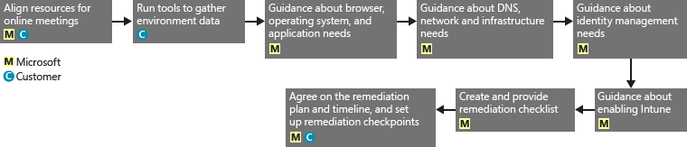
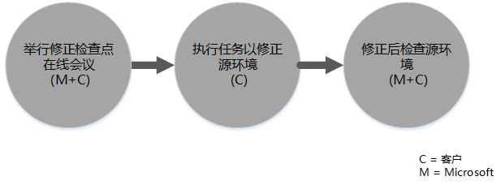

# Intune 的 FastTrack 中心权益流程
如果你的组织有资格使用 Microsoft Intune 服务权益，则你可以与 Microsoft 专家一起远程准备 Microsoft Intune 环境，使其可供使用。

Microsoft Intune 是 Microsoft 企业移动性套件 (EMS) 的一部分，它提供了企业移动性管理 (EMM) 功能，其中包括移动设备管理 (MDM) 和移动应用程序管理 (MAM)。  可以使用 Microsoft Intune 让员工能够通过设置设备、配置设备和部署移动应用在移动设备上高效工作。  此外，可以使用 Microsoft Intune 通过监视设备法规遵从性、保护移动应用程序和数据并与 Azure AD 集成以控制访问企业服务来帮助保护贵公司的数据。

若要了解贵组织是否具有资格，请参阅 [Intune 的 FastTrack 中心权益](../Topic/FastTrack_Center_Benefit_for_Intune.md)。 如果你对让自己的环境准备好使用其他企业移动性套件服务感兴趣，请参阅 [企业移动性套件的 FastTrack 中心权益](../Topic/FastTrack_Center_Benefit_for_Enterprise_Mobility_Suite.md)。

**是否在查找 Microsoft FastTrack for Office 365 的相关信息？请参阅** [Office 365 的 FastTrack 中心权益](https://technet.microsoft.com/library/office-365-onboarding-benefit.aspx)。

本文提供了有关 Microsoft Intune 服务权益的以下信息：

-   [Overview of the onboarding process](#overview_onboarding_process)

-   [Expectations for your source environment](#expectations_src_environ)

-   [Phases of the onboarding process](#phases_onboarding_process)

-   适用于每个阶段的 [Microsoft responsibilities](#microsoft_responsibilities)

-   适用于每个阶段的[Your responsibilities](#your_responsibilities)

载入完成后，您可以预期以下结果：

-   创建您的 Microsoft Online Service 租户。

-   许可用户可以使用以下标识选项之一访问 Microsoft Intune 服务：

    -   云标识（唯一的 Microsoft Online Service 帐户）。

    -   同步的标识：Microsoft Intune 帐户，借助 Azure Active Directory Connect（同步服务）将其从本地 Active Directory 同步：

        -   针对具有单一 Active Directory 林环境的客户。

        -   针对具有受支持的多林 Active Directory 拓扑的客户。

-   联合身份--Microsoft Intune 帐户：

    -   对于具有单一 Active Directory 林配置的客户，或对于具有单一 Active Directory 帐户林（亦称为“登录林”）和单一 Active Directory 资源林配置的客户，借助 Microsoft Azure Active Directory Connect 工具从 Active Directory 中进行同步。

    -   从本地 Active Directory 中，与 Windows Server 2012 R2 Active Directory 联合身份验证服务角色联合，或与 Active Directory 联合身份验证服务 (AD FS) 2.0 或更高版本联合。

## 载入流程概述
载入包含两个主要部分：

-   **核心功能** - 租户配置和与 Azure AD 的集成所需的任务（如需要）。 核心功能组件还为载入其他符合条件的服务提供基准。

-   **服务载入** - 需要配置 Microsoft Intune。

下图对使用 FastTrack 中心权益的事件顺序进行了说明。

基本流程如下所示：

-   FastTrack 中心将在你购买符合条件的计划后 30 天内与你联系。 如果你已准备好在你的组织中部署这些服务，你还可以通过 [FastTrack 中心](http://fasttrack.microsoft.com/)请求协助。 若要请求协助，请登录到 [FastTrack 中心](http://fasttrack.microsoft.com/)，转到面板，选择公司名称，单击“产品/服务”选项卡，然后单击“请求协助”按钮，以请求 Microsoft Intune、Azure Active Directory Premium 或 Azure 权限管理高级版的协助。

-   FastTrack 中心将针对核心功能为你提供帮助，然后就每个符合条件的服务帮助你进行一次载入。

所有载入支持均由 Microsoft 指定人员远程提供：

-   Microsoft 结合使用各种工具、文档和指南远程协助您完成各载入活动。

-   FastTrack 中心针对指定区域在正常营业时间内提供载入支持。

-   提供繁体中文、英语、法语、德语、意大利语、日语、葡萄牙语（巴西）或西班牙语的载入支持。

-   Microsoft 团队可直接与你或你的代表进行合作。

## 源环境预期
您的源环境中可能存在您希望移动到 Microsoft Intune 服务或与 Microsoft Intune 服务集成的一些服务。 对于某些服务，适用于 Intune 的 FastTrack 中心权益包括帮助你设置与源环境在某种程度上的集成。 如果需要集成，您的源环境必须处于该应用程序的最低级别。

下表介绍了用于载入的现有源环境的预期内容。

|活动|源环境预期|
|------|---------|
|核心功能|功能林级别设置为 Windows Server 2008 或更高版本且进行了以下林配置的 Active Directory 林：  -   单个 Active Directory 林 -   多个 Active Directory 林 **Note:** 对于所有多林配置，AD FS 部署不在 FastTrack 中心权益的范围之内。|
|服务载入  -   Microsoft Intune -   Microsoft Intune 与 System Center Configuration Manager 集成|对于使用与 Microsoft Intune 进行连接的 System Center Configuration Manager 2012 R2 或更高版本进行设备管理，IT 管理员需要遵循[管理员清单：配置 Configuration Manager 以使用 Microsoft Intune 来管理移动设备](https://technet.microsoft.com/library/jj943763.aspx). **Note:** 服务权益不提供以下帮助：将 System Center Configuration Manager 设置或升级到满足 Microsoft Intune 与 System Center Configuration Manager 集成所需的最低要求。|

## 载入流程阶段
载入包含四个主要阶段：

-   启动

-   评估

-   修正

-   启用

有关每个阶段的详细任务，请参阅 [Microsoft responsibilities](#microsoft_responsibilities)和[Your responsibilities](#your_responsibilities)部分。

### 启动阶段
购买适当数量和类型的许可证后，请按照购买确认电子邮件中的指南将许可证与现有的租户或新租户相关联。 FastTrack 中心权益将验证你的服务权益资格。 Microsoft 将在你购买符合条件的计划后 30 天内与你联系。 如果你已准备好在你的组织中部署这些服务，你还可以通过 [FastTrack 中心](http://fasttrack.microsoft.com/)请求协助。 若要请求协助，请登录到 [FastTrack 中心](http://fasttrack.microsoft.com/)，转到面板，选择公司名称，单击“产品/服务”选项卡，然后单击“请求协助”按钮，以请求 Microsoft Intune、Azure Active Directory Premium 或 Azure 权限管理高级版的协助。

在此阶段，我们将讨论载入流程，验证数据并设置启动会议。

### 评估阶段
载入流程开始之后，Microsoft 将与您一同评估您的源环境和要求。 将运行相关工具以评估您的环境，并且 Microsoft 将指导您评估您的 Internet 浏览器、客户端操作系统、DNS、网络、基础结构以及标识系统，确定是否需要针对载入进行任何更改。 根据您当前的设置，我们将提供一个修正计划，将您的源环境调整至能够满足成功载入到 Microsoft Intune 的最低要求。 在修正阶段，我们还会设置相应的检查点调用。

### 修正阶段
如果需要，您将针对源环境执行修正计划中的相关任务，以便满足载入每项服务的要求。

在开始启用阶段之前，我们将共同验证修正活动的结果以确保您可以继续后续操作。

### 启用阶段
完成所有修正活动后，项目会转而配置服务使用的核心基础结构并设置 Microsoft Intune。

**启用阶段 - 核心功能**

启用核心功能包括服务设置以及租户和标识集成。 还包括提供载入 Microsoft Intune 的基础的步骤。

核心功能启动完成后，就可以开始 Microsoft Intune 的载入。

**启用阶段 – Microsoft Intune**

对于 Microsoft Intune，根据你的移动设备和移动应用程序管理需求，我们将指导你准备好使用 Microsoft Intune 来管理设备。 具体步骤根据您的源环境而定，可能包括：

-   授权你的最终用户。 需要时，我们还将对有关如何为你的 Microsoft 云服务租户激活批量许可证提供协助。

-   通过利用本地 Active Directory 或云标识，配置将由 Microsoft Intune 使用的标识。

-   添加用户到你的 Microsoft Intune 订阅，定义 IT 管理员角色并创建用户组和设备组。

-   根据管理需要配置你的移动设备管理机构：

    -   当 Microsoft Intune 是你唯一的 MDM 解决方案或其与 Office 365 的移动设备管理结合时，将 Microsoft Intune 设置为你的 MDM 机构。

    -   如果拥有 System Center Configuration Manager 的现有实施，且想要使用 Microsoft Intune 扩展其管理功能，则将 Configuration Manager 设置为你的 MDM 机构。

        > [!NOTE]
        > 如果只希望对最终用户拥有的设备、共享设备或展台类型的设备使用移动应用程序管理，则不需要设置 MDM 机构。

-   如果移动设备管理在你的作用域中，我们将提供以下方面的指导：

    -   配置用于验证 MDM 管理策略的测试组。

    -   配置 MDM 管理策略和服务，如：

        -   通过 Web 链接或深层链接为每个受支持平台进行的应用程序部署。

        -   条件性访问策略。

        -   电子邮件配置文件部署。

        -   设置 Microsoft Intune Exchange Connector（如果适用）。

    -   将每个[支持平台](https://technet.microsoft.com/library/dn600287.aspx)的最多两个测试设备注册到你的 Microsoft Intune 或带 Microsoft Intune 服务的 Configuration Manager。

    -   使用软件和硬件清单报告。

-   如果移动应用管理 (MAM) 在你的作用域中，或者如果你希望为现有的 Microsoft 或第三方 MDM 解决方案补充 MAM 策略，我们将提供以下方面的指导：

    -   为每个支持平台配置 MAM 策略。

    -   为托管应用配置条件性访问策略。

    -   使用上述 MAM 策略定位适当的用户组。

    -   使用托管应用程序使用情况报告。

-   如果 PC 管理在你的作用域中，我们将提供以下方面的指导：

    -   在需要时安装 Intune 客户端软件。

    -   使用 Intune 中可用的软件和硬件报告。

## Microsoft 职责
本部分介绍 Microsoft 在载入流程期间的部分职责。

### 常规

-   对于所需的配置活动，为你提供远程支持协助（请参阅具体阶段中所列内容）。

-   提供可用的文档和软件工具、管理控制台和脚本，帮助您减少或消除配置任务。

### 启动阶段

-   对于新租户，在购买符合条件的许可证的 30 天内与您联系。

-   和你一起开始载入。

-   定义您要载入的符合条件的服务。

### 评估阶段

-   提供管理概述。

-   提供以下方面的指导：

    -   DNS、网络和基础结构需求。

    -   客户端需求（Internet 浏览器、客户端操作系统和服务需求）。

    -   用户标识和设置。

    -   启用已购买且定义为载入部分的符合条件的服务。

-   为修正活动设置时间表。

-   提供修正清单。

### 修正阶段

-   根据商定的日程安排与你开始电话会议，以审核修正活动的进度。

-   运行工具以识别并解决问题，并对结果进行说明，从而提供协助。

### 启用阶段
提供以下方面的指导：

-   激活您的 Microsoft Online Service 租户。

-   配置 TCP/IP 协议和防火墙端口。

-   为符合条件的服务配置 DNS。

-   验证 Microsoft Online Services 的连接。

-   对于单林环境：

    -   根据需要，在您的 Active Directory 域服务 (AD DS) 和符合条件的 Microsoft Online Service 之间安装目录同步服务器。

    -   使用 Azure Active Directory Connect 工具配置密码同步（密码哈希）到 Microsoft Intune (Azure Active Directory)。

        > [!NOTE]
        > 自定义规则扩展的开发和实现不在讨论范围内。

-   对于目标为联合标识的单林：根据需要安装并配置 Active Directory 联合身份验证服务 (AD FS)，在单个站点、容错配置中使用 Microsoft Intune 对本地域进行身份验证。

    > [!NOTE]
    > 对于多林配置，AD FS 部署不在讨论范围内。

-   如果已部署单一登录 (SSO)，则测试其功能。

#### 启用阶段 – Microsoft Intune
提供以下方面的指导：

-   授权你的最终用户。 需要时，我们还将对有关如何为你的 Microsoft 云服务租户激活批量许可证提供协助。

-   通过利用本地 Active Directory 或利用云标识，配置将由 Microsoft Intune 使用的标识。

-   添加用户到你的 Microsoft Intune 订阅，定义 IT 管理员角色并创建用户组和设备组。

-   根据管理需要配置你的移动设备管理机构：

    -   当 Microsoft Intune 是你唯一的 MDM 解决方案或其与 Office 365 的移动设备管理结合时，将 Microsoft Intune 设置为你的 MDM 机构。

    -   如果拥有 System Center Configuration Manager 的现有实施，且想要使用 Microsoft Intune 扩展其管理功能，则将 Configuration Manager 设置为你的 MDM 机构。

        > [!NOTE]
        > 如果只希望对最终用户拥有的设备、共享或展台类型的设备使用移动应用程序管理，则不需要设置 MDM 机构。

-   如果移动设备管理在你的作用域中，我们将提供以下方面的指导：

    -   配置用于验证 MDM 管理策略的测试组。

    -   配置 MDM 管理策略和服务，如：

        -   通过 Web 链接或深层链接为每个受支持平台进行的应用程序部署。

        -   条件性访问策略。

        -   电子邮件配置文件部署。

        -   设置 Microsoft Intune Exchange Connector（如果适用）。

    -   将每个支持平台的最多两个测试设备注册到你的 Microsoft Intune 或带 Microsoft Intune 服务的 Configuration Manager。

    -   使用硬件和软件清单报告。

-   如果移动应用管理 (MAM) 在你的作用域中，或者如果你希望为现有的第三方 MDM 解决方案补充 MAM 策略，我们将提供以下方面的指导：

    -   为每个支持平台配置 MAM 策略。

    -   为托管应用配置条件性访问策略。

    -   使用上述 MAM 策略定位适当的用户组。

    -   使用托管应用程序使用情况报告。

-   如果 PC 管理在你的作用域中，我们将提供以下方面的指导：

    -   在需要时安装 Intune 客户端软件。

    -   使用 Intune 中可用的软件和硬件报告。

## 您的职责
本部分介绍您在载入流程期间的部分职责。

### 常规

-   本文所列的可配置选项以外的 Microsoft Online Service 租户的所有增强功能和集成。

-   资源的总体计划和项目管理。

-   最终用户通讯、文档、培训和变更管理。

-   支持人员文档和培训。

-   制作特定于组织的所有报表、演示文稿或会议记录。

-   制作特定于组织的体系结构和技术文档。

-   设计、采购、安装和配置硬件和网络。

-   采购、安装和配置软件。

-   配置、打包和分发 Microsoft Intune 所需的客户端软件。

-   激活移动设备。

-   网络配置、分析、带宽验证、测试和监视。

-   管理技术变更管理审批流程并制作支持文档。

-   为用户、工作站和服务器管理指定和定义组策略。

-   修改操作模型和操作指南。

-   设置多重身份验证。

-   停用和移除源环境（类似于其他电脑或设备管理解决方案）。

-   构建和维护测试环境。

-   在基础结构服务器上安装服务包和其他所需的更新。

-   提供和配置所有公共 SSL 证书。

-   撰写组织的使用条款 (TOU) 声明，使其在最终用户可访问的 Microsoft Intune 公司门户上处于可配置和可显示状态。

### 启动阶段

-   与 Microsoft 团队合作，开始载入符合条件的服务。

-   参加接洽启动会议、管理和领导您组织中的参与者并确认修正时间表。

### 评估阶段

-   标识相应的利益干系人（包括项目经理）以完成必要的评估活动。

-   如果您愿意，当您针对您的环境或 Microsoft Intune 订阅运行评估工具时，如果您需要指导，可与 Microsoft 共享您的屏幕。

-   参加会议以创建修正清单并促成整体计划，包括基础结构、网络、管理、目录同步准备、网络安全和联合标识主题。

-   参与会议以列出用户设置方法的提纲。

-   参加会议以规划联机服务配置。

-   为迁移就绪制定一个支持计划。

### 修正阶段

-   执行所需步骤以完成评估阶段中确认的修正活动。

-   参与检查点会议。

### 启用阶段

-   如果您愿意，当您对环境或 Microsoft Online Service 订阅运行更改时，如果您需要指导，可与 Microsoft 共享您的屏幕。

-   适当管理资源。

-   依照 Microsoft 的指导，配置网络相关项。

-   依照 Microsoft 的指导，执行目录准备工作并配置目录同步。

-   依照 Microsoft 的指导，配置安全相关的基础结构（如防火墙端口）。

-   实现相应的客户端基础结构。

-   依照 Microsoft 的指导，实现用户设置方法。

-   依照 Microsoft 的指导，启用各种服务。

-   与 Microsoft 一同在开始载入后的 12 个月内完成所有符合条件的服务的载入。

-   使用 Microsoft Intune 启用电脑或移动设备管理时，在通过 Microsoft Intune 启用管理策略时使用测试设备。 如果测试设备不可用，则客户负责进行备份，并根据需要还原在 Microsoft Intune 启用阶段所使用设备中的所有内容。

-   对于可通过 Web 链接或深层链接部署的所有 Microsoft Intune 支持平台，最多选择两个应用程序。

-   管理、配置和应用除用于测试 Microsoft Intune 服务基准配置和功能之外的安全策略。

## 了解更多信息？
请参阅 [Microsoft Intune](http://www.microsoft.com/en-us/server-cloud/products/microsoft-intune/default.aspx) 和[企业移动性套件](http://www.microsoft.com/en-us/server-cloud/products/enterprise-mobility-suite/default.aspx)。

